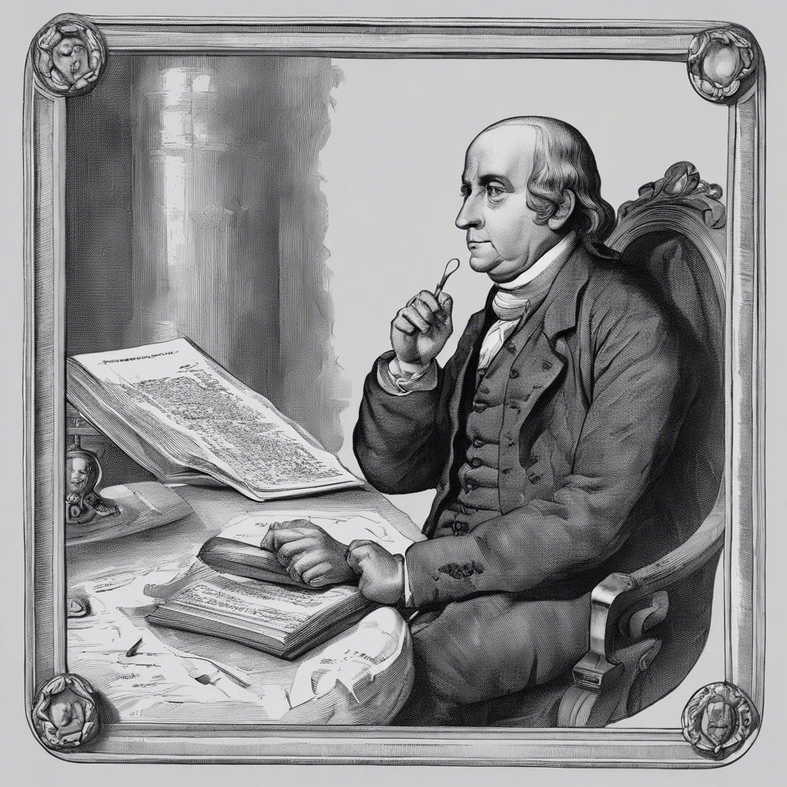

- El tiempo ⏱️que dedico a mi físico es hacer ejercicio en mi caminadora 🏃🏽 ✅
- El tiempo ⏱️ para mi actividad mental es buscar 🔍 cursos, tomar cursos n Platzi, Crehana, Domestika, Udemy, Coursera, LearnPromptig y IA Gen en Google y leer este libro como otros en Headway, Beek, Audible, Bookster, y Fabula ✅
- A lo espiritual puede ser el Mindfulness 🧘🏽

🌟🧠 Somos el tesoro más valioso de nuestra existencia. Cuidar, invertir y potenciar nuestro ser es el activo más preciado que impulsa todas nuestras empresas en la vida. 💪💎

---

Por eso decían Robert Kiyosaki y Kiyosaki y Benjamín Franklin, invertir en ti es el mejor activo. Vacia tus bolsillos en aprender que aprender llenara tus bolsillos. 

---

📈💡 La inversión en uno mismo es el único depósito que siempre rinde beneficios, sin importar la marea económica o social. Es el tesoro que crece con cada adquisición de conocimiento, habilidad y crecimiento personal. 🌟💰

💪🧠🌟 Para alcanzarlo, debemos cuidarnos en todos los aspectos: físicamente para fortalecer el cuerpo, mentalmente para nutrir la mente y espiritualmente para avivar el alma. Es el equilibrio que impulsa nuestro potencial máximo. 🌿✨

⏸️🔋 Tomar tiempo para recargarlas pilas  es vital para mantener nuestra eficiencia. 
Es a lo que el autor se refiere como afilar el hacha: nos permite trabajar con mayor precisión y efectividad. El descanso es la clave para una productividad sostenible. 🌟🪓

---
## 4 dimensiones de nuestra vida como humanos. 

- **Física:** 🥦🏋️‍♀️ Ser consciente de nuestra alimentación y hacer ejercicio regularmente es el combo perfecto para una salud física óptima. Cuidar el combustible que le damos al cuerpo y mantenerlo activo es la clave para un bienestar físico. 💪🍏
- **Espiritual:** 🧘‍♂️🌿 La dimensión espiritual se nutre de la atención plena, la armonía interna y la definición de nuestra misión personal en el mundo, como el Ikigai. El mindfulness es el faro que ilumina el camino hacia la conexión con uno mismo y el propósito en la vida. 🌟🌎. 
- **Mentalmente:** 📚📺 Invertir más tiempo en el estudio y menos en la televisión es cultivar la mente. Escribir un diario y poemas es el ejercicio que nutre el intelecto y el alma, alimentando la creatividad y el crecimiento personal. 🌟📖
- **Socialmente:** 🤝✨ Cultivar relaciones saludables y convivir en armonía con todos es el arte de tejer una red social sólida. Ser encantador y agradable es la clave para sembrar semillas de amistad y construir puentes que conectan corazones. 🌐💖

⚡Tómate tiempo  para reflexionar y reponer fuerzas. Evaluar tu rendimiento te ayuda a ver con claridad e que debes trabajar. 

